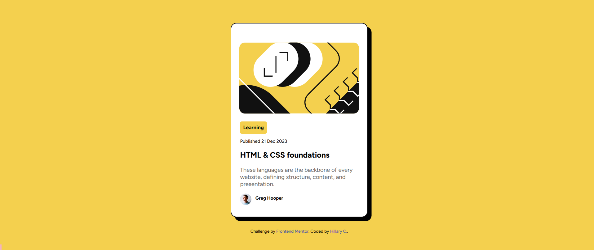

# Frontend Mentor - Blog preview card solution

This is a solution to the [Blog preview card challenge on Frontend Mentor](https://www.frontendmentor.io/challenges/blog-preview-card-ckPaj01IcS). 

## Table of contents

- [Overview](#overview)
  - [The challenge](#the-challenge)
  - [Screenshot](#screenshot)
  - [Links](#links)
- [My process](#my-process)
  - [Built with](#built-with)
  - [Useful resources](#useful-resources)
- [Author](#author)
- [Acknowledgments](#acknowledgments)

**Note: Delete this note and update the table of contents based on what sections you keep.**

## Overview

### The challenge

Users should be able to:

- See hover and focus states for all interactive elements on the page

### Screenshot

### Links

- Solution URL: [Add solution URL here](https://your-solution-url.com)
- Live Site URL: [Add live site URL here](https://your-live-site-url.com)

## My process

### Built with

- HTML
- CSS

### What I learned + Useful resources

- [Hover](https://www.w3schools.com/cssref/sel_hover.php) - Learned how to change the color of a text when the pointer hovers on it. 
- [Image beside text](https://www.shecodes.io/athena/37856-how-to-move-text-to-the-right-side-of-an-image-with-css#:~:text=In%20this%20example%2C%20float%3A%20left,right%20side%20of%20the%20image) - Learned how to place the text beside the image for the author section. 
- [QR Component feedback on frontendmentor.io](https://www.frontendmentor.io/solutions/qr-code-component-with-css-5PakVqgsg3) - Used a grid to center all elements and attempted to start with mobile-first workflow. I am still not entirely sure if I did it correctly, how exactly should it be done, or if it is easier than starting with the desktop version. 
- Declared the font globally from within the assets folder, part of this was also mentioned as feedback in the resource above.

## Author

- GitHub - [Hillary C.](https://github.com/hlrydev)